# Sumin Lee
MS, Department of Artificial Intelligence  
Korea Brain Research Institute & Kyungpook National University  

📧 [sminlee0123@@gmail.com](mailto:sminlee0123@gmail.com) | [sminlee0123@kbri.re.kr](mailto:sminlee0123@kbri.re.kr)  
✨ [Homepage](https://sminlee01023.github.io/)

---

## 🎓 Education
- **M.S. in Artificial Intelligence**, Kyungpook National University, Korea (Sep 2024 – Aug 2026)  
- **B.S. in Biomedical Engineering & Bio-Mechatronics (AI track)**, Gachon University, Korea (Feb 2020 – Feb 2024)  
  - *Cum Laude*  

---

## 🔬 Research Interests
- Functional neuroimaging (fMRI, fNIRS) for language and cognition  
- Brain decoding using machine learning and deep learning methods  
- Neural mechanisms of lexical processing and cognitive control  

---

## 📄 Publications
- **Lee S.**, Park E., Cheong Y., Ro J., Kim J., **Lee H., Jung M.*** (2026).  
  *Feasibility and preliminary signal of cerebellar intermittent theta burst stimulation for static balance in cerebellar ataxia: a pilot study.* **Frontiers in Neurology, 17, 1826602.** https://doi.org/10.3389/fneur.2026.1826602  
- **Lee S.**, Kim J., **Son Y.*** (2025).  
  *Identifying Language Processing Brain Networks in Object Naming Tasks using Dynamic Functional MRI.* Manuscript in preparation.  

---

## 🎤 Conferences (Selected)
- **Lee S.**, Cheong Y., ... **Jung M.*** (2026).  
  *When Brain Signals Speak: Predicting L2 Proficiency in an fNIRS Language-Switching Paradigm* KSCP, Jan 2026 – **Oral**
- **Lee S.**, Cheong Y., ... **Jung M.*** (2025).  
  *Bilingual Language Switching: Evidence of Enhanced Cognitive Control from Multimodal Data.* BESK, Jun 2025 – Poster
- **Lee S.**, Park E., Cheong Y., ... **Jung M.*** (2025).  
  *Effects of rTMS on Static Balance and Higher-Level Motor Function in Cerebellar Ataxia: A Pilot Study.* OHBM, Jun 2025 – Poster  

---

## 🏆 Awards
- **Academic Excellence**, Gachon University, Korea (six times, 2021–2023)  

---

## 📜 Additional Trainings (Selected)
- **RIKEN CBS Summer Program 2026 - Development and Disorders: Genes, Networks, and Behavior Across Life**, RIKEN Center for Brain Science (2026)
- **KHBM Spring Symposium - Gradient Course**, Korean Society of Human Brain Mapping (2026)
- **KHBM Spring Symposium**, Korean Society of Human Brain Mapping (2025)
- **OHBM 2024 Annual Meeting**, Organization for Human Brain Mapping (2024)
- **Deep Learning Summer School**, Gachon University, Korea (2023)  
- **Advanced Deep Learning Winter School**, DEEPNOID & Gachon University, Korea (2022)  

---

## 🛠 Skills
- **Neuroimaging Analysis**: MRI (SPM12, MATLAB, Python, R), fNIRS (MATLAB, Python)  
- **Physiological Signal Processing**: EMG, GSR, eye-tracking, pupillometry (MATLAB, Python)
- **Data Science & ML**: Feature engineering, predictive modeling (Python)  
- **Experimental Design & Programming**: E-Prime, PsychoPy  
- **3D Modeling**: AutoCAD for research and experimental setups  

---

## 💻 Code Availability
The code related to my current projects will be made publicly available once the corresponding manuscripts are published.

